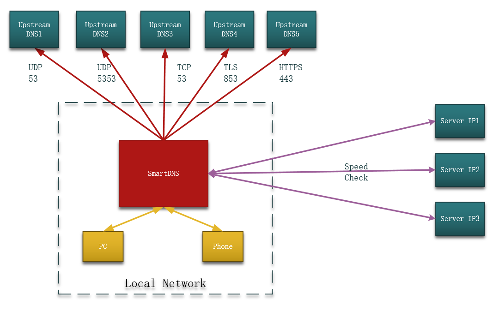
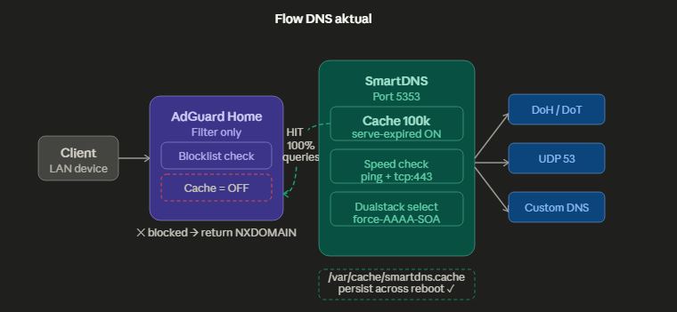

# 🛡️ AdGuard Home + SmartDNS Optimization (Ubuntu 22.04)

Dokumentasi ini berisi panduan instalasi dan konfigurasi optimasi DNS menggunakan **AdGuard Home** sebagai frontend (Filtering) dan **SmartDNS** sebagai backend (Speed/Racing Upstream).

## 🚀 Mengapa Kombinasi Ini?
- **AdGuard Home:** UI yang luar biasa untuk memantau trafik, manajemen client, dan filter iklan/malware yang sangat mudah.
- **SmartDNS:** Mesin DNS paling efisien untuk melakukan *racing* (mencari upstream tercepat) secara paralel dan manajemen cache tingkat tinggi.

## 🏗️ Arsitektur Jaringan
`Client` -> `AdGuard Home (Port 53)` -> `SmartDNS (Port 5353)` -> `Internet (DoH/DoT Upstreams)`


---

---
## 🛠️ Langkah Instalasi

### 1. Update Sistem & Tool Dasar
```bash
sudo apt update && sudo apt install curl wget tar -y
```
### 2. Instalasi SmartDNS (Backend)
Gunakan rilis terbaru dari SmartDNS GitHub.

```bash
# Pindah ke direktori sementara
cd /tmp

# Ambil link download rilis terbaru secara otomatis
URL=$(curl -s https://api.github.com/repos/pymumu/smartdns/releases/latest | grep "browser_download_url.*x86_64-linux-all.tar.gz" | cut -d '"' -f 4)

# Download file tar.gz-nya
wget $URL

# Ekstrak file yang baru di-download
tar -xvf smartdns*.x86_64-linux-all.tar.gz

# Masuk ke folder hasil ekstrak (biasanya bernama 'smartdns')
cd smartdns
sudo ./install -i
```
Gunakan konfigurasi yang tersedia di `./install/smartdns.conf.`

### 3. Instalasi AdGuard Home (Frontend)
```Bash
curl -s -S -L [https://raw.githubusercontent.com/AdguardTeam/AdGuardHome/master/scripts/install.sh](https://raw.githubusercontent.com/AdguardTeam/AdGuardHome/master/scripts/install.sh) | sh -s -- -v
```
Akses di `http://IP-SERVER:3000` untuk setup awal.

⚙️ Konfigurasi Penting
#### 1. Di SmartDNS: Jalankan di port 5353 agar tidak bentrok dengan AGH.

#### 2. Di AdGuard Home: Masukkan 127.0.0.1:5353 di menu Settings -> DNS Settings -> Upstream DNS Servers.

#### 3. Optimasi: Matikan Cache di AdGuard Home dan biarkan SmartDNS yang menangani seluruh Cache jaringan.
